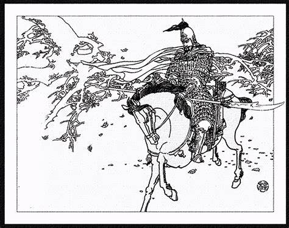

# E2_JavaPractice
Java practice

# GJschool專案
## 第一章
### 第一小節
#### A
##### A_1
###### A_1_1

  hihihihi 
  ohohohoh 
  jeejeehee 

//
要隔行才有用

[Yahoo](http://tw.yahoo.com)

[Google](http://www.google.com)

## [文字解說](blog/index.html)

<li>台北捷運板南線</li>
<li>台北捷運淡水線</li>
<li>台北捷運木柵線</li>
<li>台北捷運新店線</li>
<li>台北捷運中和線</li>
<li>台北捷運內湖線</li>
</ul>

<ol type="1">
<li>Apples</li>
<li>Bananas</li>
<li>Lemons</li>
<li>Oranges</li>
</ol>
